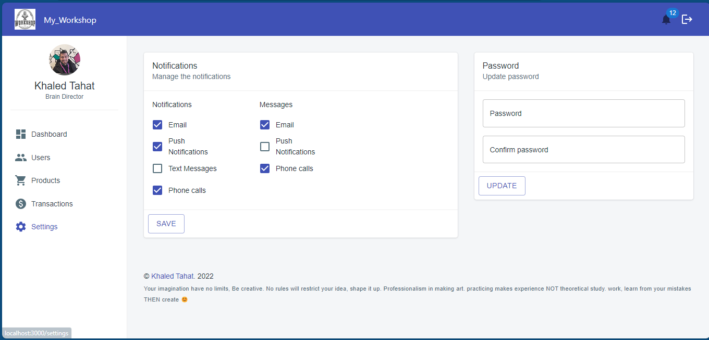

# Workshop Dashboard 💨

The Workshop Dashboard is a web application designed to provide an intuitive interface for managing user data, products, and transactions in a workshop environment. It serves as a centralized platform for administrators to perform CRUD operations seamlessly.

## Features 🪶

- **Authentication:** The dashboard features a secure authentication system that allows only authorized administrators to log in.

  ;

- **Dashboard Section:** Provides an insightful overview of users, products, and transactions through data analytics and visualizations.

  ;

- **User Management:**

  - View a list of all users.
  - Add new users.
  - Delete or block existing users.

  ;

- **Transaction Management:**

  - View a list of all transactions.
  - Update the state of a transaction to pending, delivered, or canceled.

  ;

- **Product Management:**

  - View a list of all products.
  - Add new products.
  - Delete or update existing products.

  ;

  ;

- **Notification System:**

  - Get real-time notifications when a new transaction occurs.

  ;

- **Confirmation Alerts:**

  - Receive confirmation alerts for every possible process the admin can perform.

  ;

- **Settings Feature:**

  - Manage notifications and messages.
  - Update your password.

  ;

## Getting Started ⭐

### Prerequisites

- Node.js installed
- MongoDB installed and running

### Installation 🎺

1.  Clone the repository:

    ```bash
    git clone git@github.com:KZTahat/workshop_dashboard.git
    ```

2.  Set up environment variables:

    Create a .env file in the root directory with the next variables inside.

        REACT_APP_PRODUCTS=<Server>/api/v1/products
        REACT_APP_USERS=<Server>/api/v1/users
        REACT_APP_TRANSACTIONS=<Server>/api/v1/transactions

3.  Replace the "server" with the actual running server

        https://my-workshop.onrender.com

4.  Install dependencies:

        npm start

## Enjoy 🤝

I'm giving you the experience to interact with a real dashboard with actual data stored in the database, feel free to add, update and delete any record any, The dashboard is real
